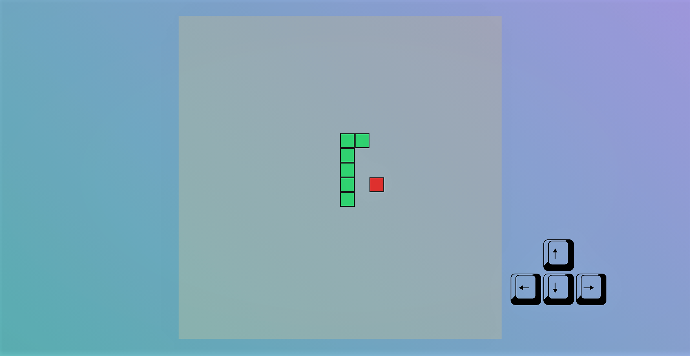

# SnakeGame by JS
I have built a simple keyboard-control snake game with JavaScript and CSS grid
# Features
  - beautiful game board
  - easy and logical keyboard control( disabled user's ability to go to a direction directly from the opposite direction)
  - game over when the snake hits the wall or intersects itself
  - prompt when game is over and then ask for user's input to determine if the game is going to replay or stop
  

